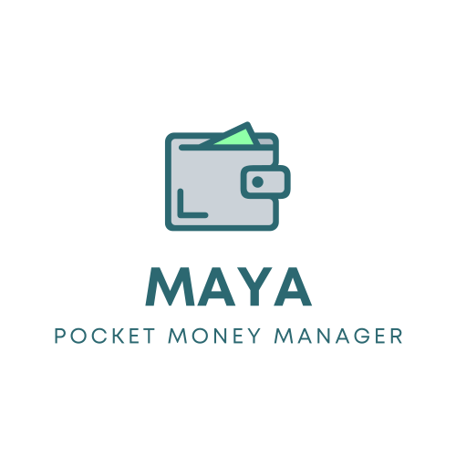

<!-- ALL-CONTRIBUTORS-BADGE:START - Do not remove or modify this section -->

<!-- ALL-CONTRIBUTORS-BADGE:END -->

<div align="center">

</div>
App to manage your pocket money and keep track of your expenses and account between multiple people

## Features

### Current release (v1.0.0) 🏃

-   Track expense between multiple people
-   Day start and day end cash in hand
-   Debit/credit system (if someone asks for some money, than you can put that to your account as well)
-   Automatic calculation of total amount of money in hand

-   Group:
    -   you can remove people of group from a particular entry if they are not involved in that entry
    -   Create groups and add people to it
    -   when creating a new entry with group, app will automatically add the users in group to that entry
    -   when new person is added to the group, he/she will be only added when he accepts the invite
    -   on leaving the group, group admin will approve first that he can leave the group
-   between 2 people:
    -   when a person is creating a entry that he paid to another person than the other person will be notified and he can accept or reject the entry, weather he is paid or not

### Future releases 🚀

-   You can set daily budget and app will notify you when you are going to exceed your budget
-   show average daily spend
-   Manage budget of trips
    (if you are going to a trip with your friends than you can create a new trip and add people to it.
    each person can add their budget for the trip and you will see that. you can plan your trips according to your budget and while spending on the trip you can also keep record of who spent how much and also see how much money is left. and remaining money can be divider among the people who are in the trip).
-   Auto adjust money between people (if 2 people are together and one person spent 30rs one time and another spend 20 next time than app will automatically adjust that only 10rs is left to be paid by the person who spend 20rs)

## Discord

Calling all coding enthusiasts! If you want to be a part of our ongoing project, Maya, and other upcoming projects in the near future, join our server. Whether you want to contribute or become an official member of the server, we invite you to join us! Discord link: **[Discord](https://discord.com/invite/A2GdYbwAnw)**

## Docs

All the docs for each project are present in their respective directories in `docs` folder

## Setting up the development environment

### Prerequisites

-   [Node.js](https://nodejs.org/en/)
-   [Yarn](https://yarnpkg.com/)
-   [PostgreSQL](https://www.postgresql.org/)
-   [Docker](https://www.docker.com/) (optional)

> :memo: This project uses [Yarn workspaces](https://yarnpkg.com/features/workspaces) to manage multiple packages in a single repository. You will need to use Yarn to install the dependencies and run the scripts.

### Installation

> You also need to setup server so that client can make API calls.
> Check out the [server](https://github.com/maya-manager/server) repository for docs on
> how to setup server locally

1. create another `.env` file in root of the project. You can copy the `.env.example` file and rename it to `.env`.

    > make sure update the environment variables based on your needs.

1. Run the client by using

```bash
yarn start
```

#### Docker

1. Use the `docker-compose.yml` file to start the server, client and postgreSQL containers.

2. You will need to create a `.env` file in the root of the project. You can copy the `.env.example` file and rename it to `.env`.

    > make sure update the environment variables based on your needs.

3. Run the containers by using

```bash
docker-compose up
```

> :warning: If you are using docker to run client than you need to manually put the `IP` address of your machine in the `expo` to run the app on your phone.
> example if `IP` address of your machine is `192.172.36.18` than you expo url will be `exp://192.172.36.18:19000` and you will need to put this address in your emulator or phone in expo app.

## UI Design

[Figma URL](https://www.figma.com/file/ojtvKg3GqfcWxfQh8CPBFO/Maya?type=design&t=YiQRFjTrCGUL18Ic-1)

## Technologies

-   [React native](https://reactnative.dev/)
-   [Expo](https://expo.io/)
-   [TypeScript](https://www.typescriptlang.org/)

## Contributors ✨

Thanks goes to these wonderful people ([emoji key](https://allcontributors.org/docs/en/emoji-key)):

<!-- ALL-CONTRIBUTORS-LIST:START - Do not remove or modify this section -->
<!-- prettier-ignore-start -->
<!-- markdownlint-disable -->
<!-- markdownlint-restore -->
<!-- prettier-ignore-end -->

<!-- ALL-CONTRIBUTORS-LIST:END -->

This project follows the [all-contributors](https://github.com/all-contributors/all-contributors) specification. Contributions of any kind welcome!
